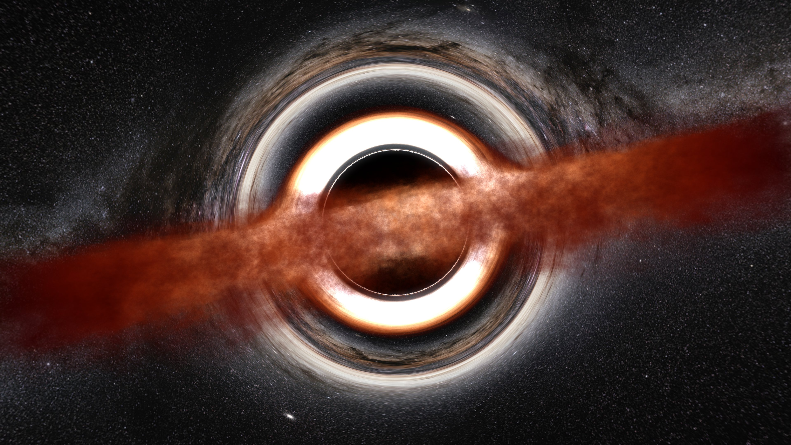
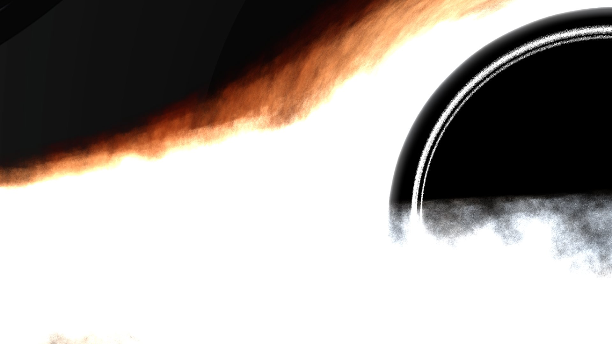

# 黑洞渲染器

参考:
> 从零开始搓一个黑洞——glsl编程实战
> <https://zhuanlan.zhihu.com/p/20536269771>
> <https://www.shadertoy.com/view/4XcfR2>
> Baopinsui

---

## 简介

基于相对论的 light-casting 渲染器, 为了视觉效果引入了很多非物理的参数和机制.

## 效果




## 编译 & 使用

```bash
make
make run
```

将在项目目录生成 `test.jpg`.

## TODOs

- [ ] 命令行参数解析
- [ ] 动态参数加载
- [x] 严格遵守相对论效应
- [ ] 并行计算提升性能
